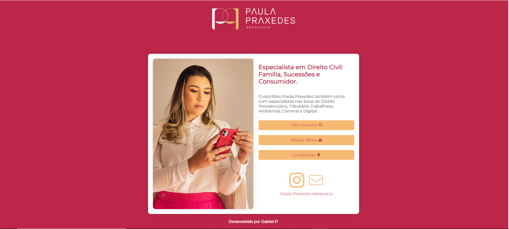

### Documentação do Site
#### Descrição

Este repositório contém a documentação para o site desenvolvido utilizando HTML e CSS. O site foi criado com o intuito de apresentar o Escritório de Advocacia da Paula Praxedes [Site](https://paula.drakonara.com/).

Estrutura do Site
O site é composto por uma página HTML, organizada da seguinte forma:

``` index.html: Página inicial do site. ```

``` css/style.css: Arquivo de esterilização do site. ```

``` img/: Pasta com imagens usadas do site. ```



### Alteração do Tema
O tema do site pode ser personalizado facilmente, alterando-se os estilos no arquivo style.css. Este arquivo contém as regras de estilo que controlam a aparência de todos os elementos do site.

Controle de Aparência de Várias Páginas
Para aprimorar a experiência do usuário, o site foi desenvolvido com um design adaptativo, que se ajusta de forma otimizada tanto para dispositivos móveis quanto para desktops. Isso garante uma navegação fluída e uma visualização confortável em qualquer dispositivo utilizado pelo usuário.

#### Contribuições
Lembrando que, para facilitar o acesso rápido às informações de um escritório de advocacia, o site foi criado de forma simples e direta, priorizando a praticidade e a eficiência.
Contribuições são bem-vindas! Se você identificar algum problema ou tiver sugestões de melhorias, sinta-se à vontade para abrir uma issue ou enviar um pull request.
